# The code

Attached to this report is the code of the genetic algorithm. 
During this report we will not mention the code but we will explain the different steps of the algorithm.

# The genetic algorithm

Genetic algorithms are a type of optimization algorithm that are inspired by the process of natural selection in biology. They are commonly used to find solutions to complex problems that are difficult to solve using traditional methods. The basic steps of a genetic algorithm are as follows:

1. **Initialization**: Start by creating an initial population of candidate solutions to the problem at hand. This population should be large enough to capture a wide range of potential solutions, but not so large that it becomes computationally infeasible to work with.

2. **Evaluation**: Calculate the fitness of each solution in the population, which is a measure of its ability to solve the problem at hand. This is typically done by applying a set of objective functions that evaluate the quality of the solution based on pre-defined criteria.

3. **Selection**: Use the fitness values to select the most promising solutions from the current population. These solutions will be the "parents" that are used to generate the next generation of candidate solutions.

4. **Crossover**: Create new solutions by combining the genetic material of the selected parent solutions in a process known as crossover. This can be done in a number of ways, but the goal is to create new solutions that retain the best features of the parents while also introducing some level of variation.

5. **Mutation**: Introduce random changes to the genetic material of the new solutions in a process known as mutation. This can help to prevent the algorithm from getting stuck in a local optima and can also help to explore new regions of the search space.

6. **Repeat**: Repeat these steps for a number of generations, with each new generation of solutions being created based on the previous one. As the algorithm progresses, the solutions in the population should become increasingly fit and better able to solve the problem at hand.

7. **Termination**: Stop the algorithm when a satisfactory solution is found or when a pre-determined stopping condition is met. The final solution is the one that has the highest fitness among all of the solutions in the final generation.

# The knapsack problem

The knapsack problem is a problem in combinatorial optimization. Given a set of items, each with a weight and a value, the goal is to determine the number of each item to include in a collection so that the total weight is less than or equal to a given limit and the total value is as large as possible.

During this project, we will use a simpler version of the knapsack problem where $weight_i = value_i$ for all $i$.

We will use a genetic algorithm to solve this problem.

## The data 

The population in a genetic algorithm for the knapsack problem can be represented as a collection of candidate solutions, with each solution representing a specific combination of items to include in the knapsack. 

These solutions can be encoded as binary integer, with each bit in the integer representing the presence or absence of a particular item in the knapsack. For example, if there are five items, the value `25` which is `11001` in binary would represent a solution in which the first, second, and fifth items are included in the knapsack, but the third and fourth items are not.

## First sample test : 28 objects and a capacity of 1581

As a stopping condition for the main loog of generations we stop if we find an exact match to fill the knapsack or if we reach a maximum number of iterations. In this case, we reached the maximum number of iterations (101).

Results :

`charge_poids (/data_sad/nbrobj28_capacite1581.txt) :` 
`sum of the weights of the objects = 4226`
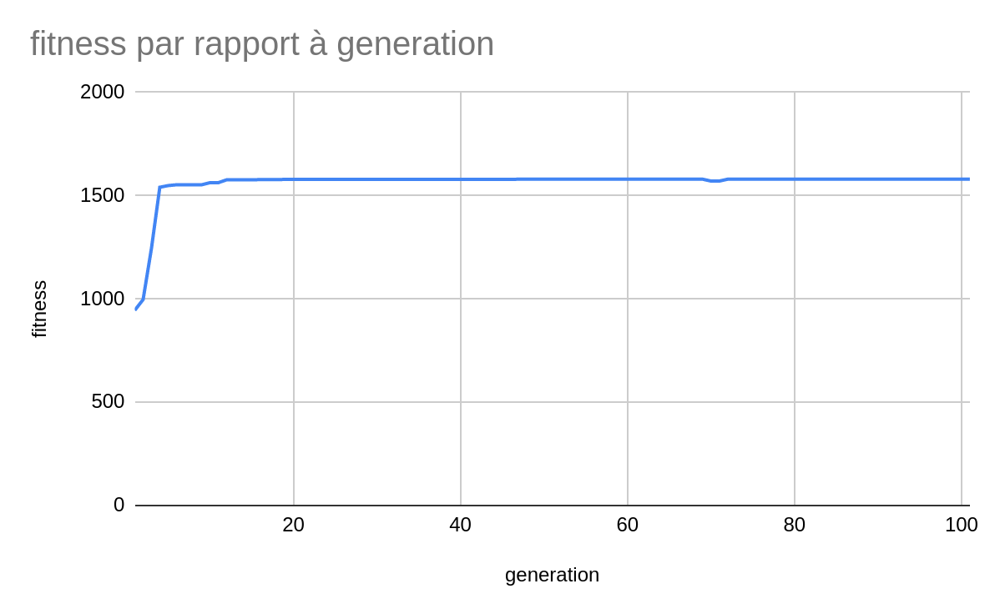

```
Number of iterations : 101
Mean Adaptation : 1370.4950495049504
Maximum Adaptation : 1580.0
```

For this sample, the genetic algorithm finds a solution with an adaptation of 1580. 

On the graph, we can see that the adaptation is rapidly increasing until it reaches a maximum and then stays constant. This is due to the fact that the genetic algorithm is not able to find a better solution. 

## Second sample test : 70 objects and a capacity of 350

Results :

`charge_poids (/data_sad/nbrobj70_capacite350.txt) :`
`sum of the weights of the objects = 357`
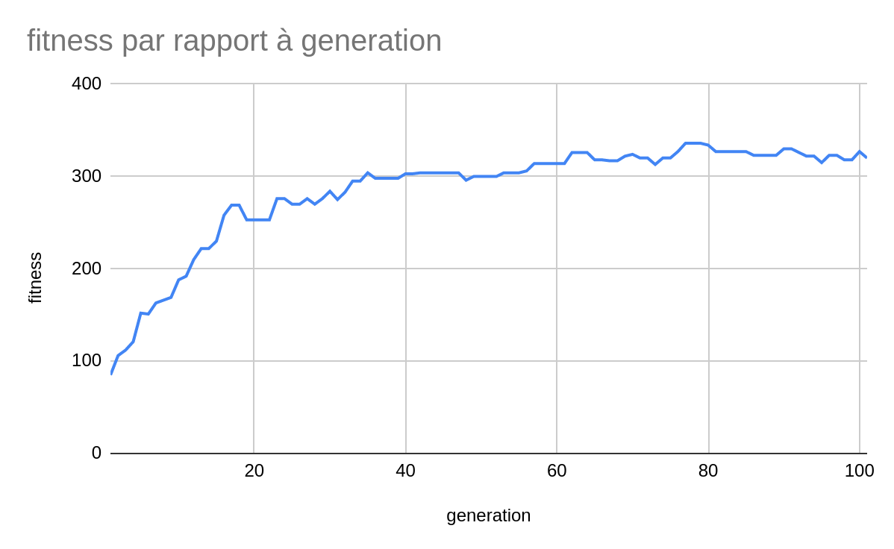
```
Number of iterations : 101
Mean Adaptation : 272.8514851485148
Maximum Adaptation : 320.0
```

For this new sample, the genetic algorithm finds a solution with an adaptation of 320.

On the graph, we can see that the adaptation converges to a solution but this time it is as constant as the previous sample. Let's try to increase the number of iterations to see if we can find a better solution.

### Change the maximum number of iterations to 500

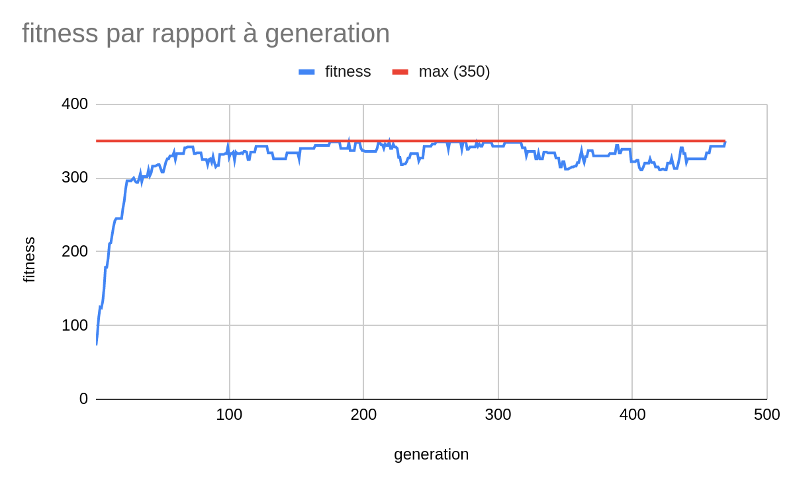

```
Number of iterations : 469
Mean Adaptation : 256.55445544554453
Maximum Adaptation : 350.0
```

During this run, the genetic algorithm finds a solution with an adaptation of 350 which is actually the best solution for this sample because it is the maximum adaptation possible. 

This is why the generation stops at 469 iterations and not 500.

# Travelling salesman problem

The traveling salesman problem is a problem that seeks to find the shortest possible route that visits a given set of locations and returns to the starting point.

## The data

In a genetic algorithm for the traveling sales problem, the data of an individual can be represented as a permutation of the locations to be visited. 

For example, if the locations are represented by the numbers 1 through N, then a possible solution for an individual could be the permutation `[3, 2, 1, 4, 5, 6, ..., N]`. This solution would represent a route that starts at location 3, visits location 2 next, then location 1, and so on, until all locations have been visited and the route returns to the starting point. 

Bellow, the permutation will be encoded as a list of numbers.

## First sample test : circle of 64 cities


This is the initial state (randomized) :
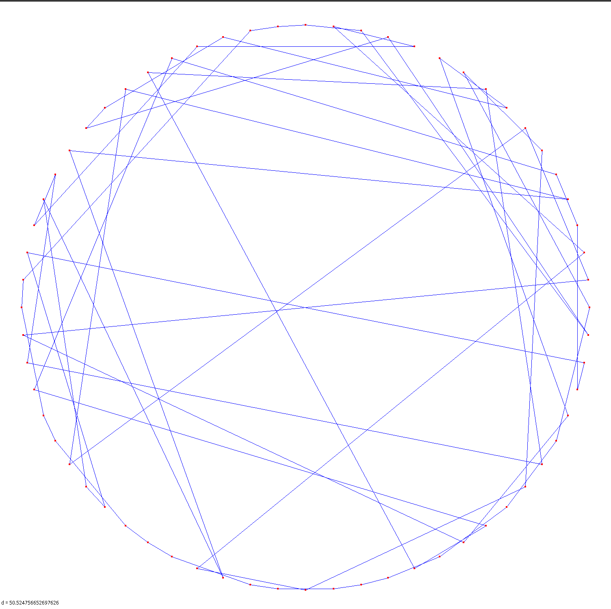

After 100 generations, we can see that the algorithm has found a solution that is not optimal but that is good enough for this sample :
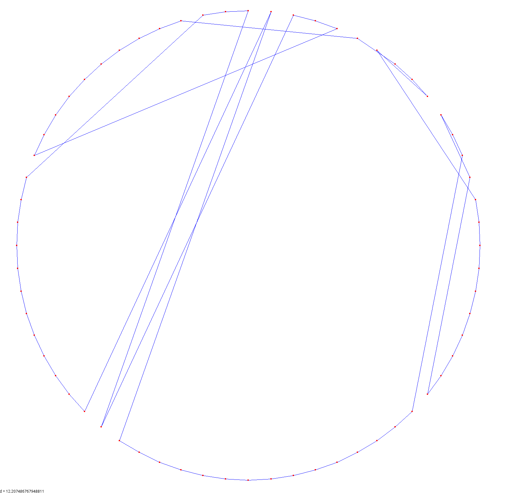

After 1000 generations, we can see that the algorithm has found a solution that almost perfectly fits the circle :
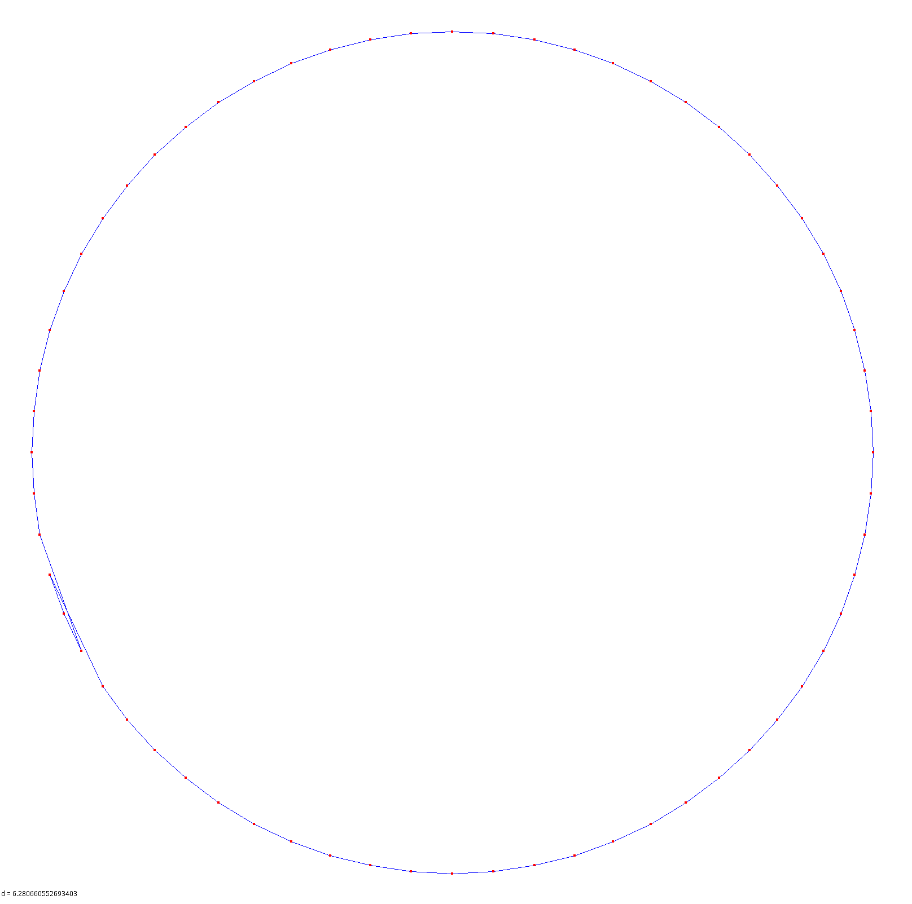


## Second sample test : 256 cities

This is the initial state (randomized) :
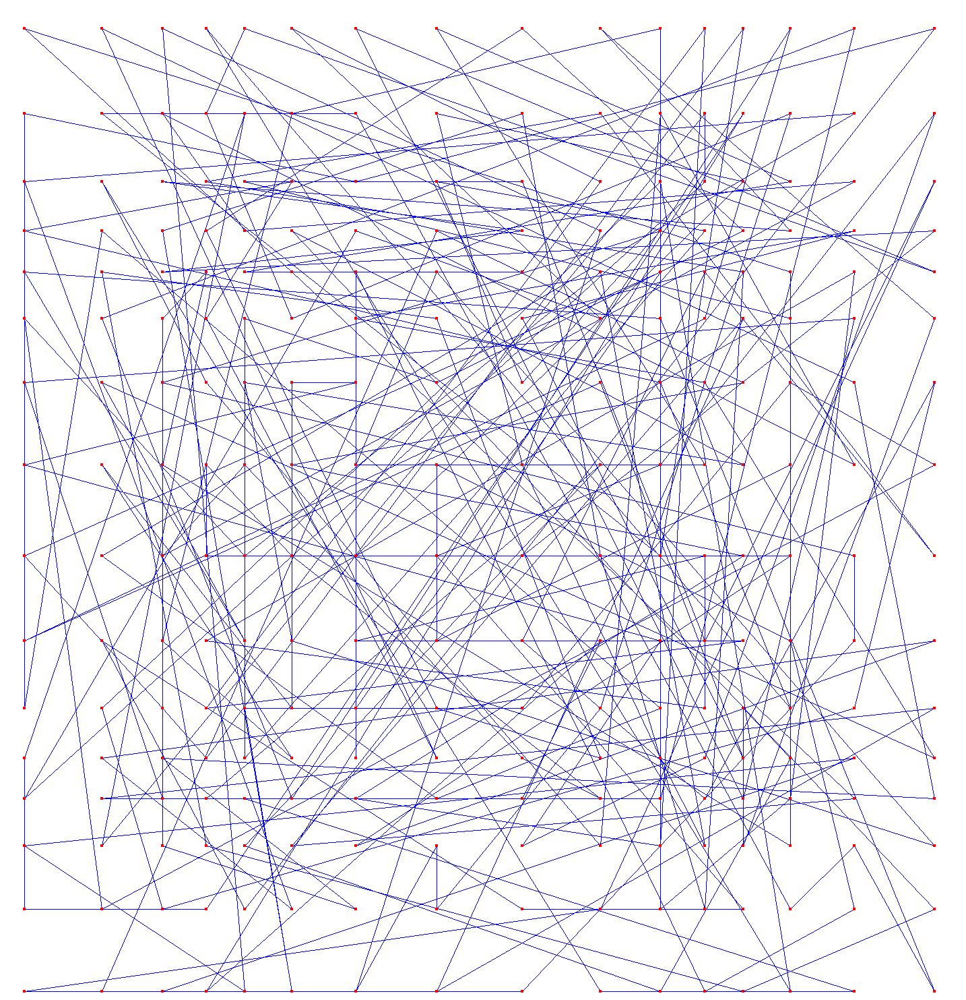

After 3000 generations, we can see that the algorithm has found a solution that is not optimal but is less a mess than the initial state :
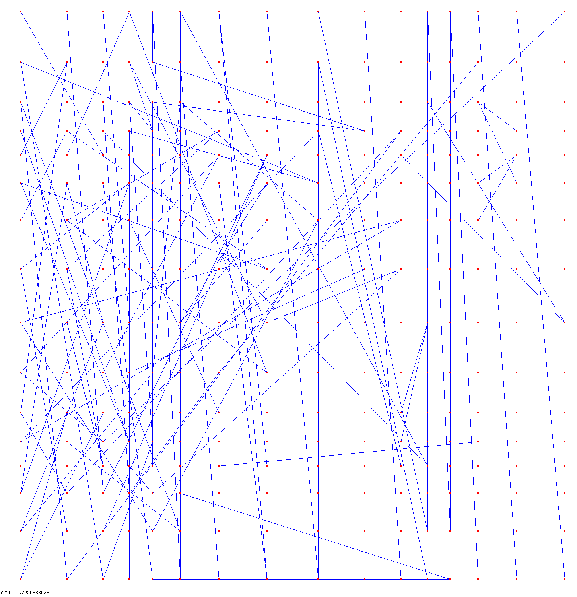

Sadly after 10000 generations, the algorithm has not found a better solution. We can see that the algorithm struggles to find a solution with this much cities.

Let's try to optimize the algorithm to see if we can find a better solution.

## The 2-opt optimization algorithm

The `optim_2opt` method found inside the `Individu_VDC` class is an implementation of the 2-opt optimization algorithm for the traveling sales problem. This algorithm is used to improve the quality of a given solution by iteratively removing and re-inserting edges in the route in order to reduce the total distance traveled.

The `gain` method is a helper function used by `optim_2opt` to calculate the change in total distance that would result from removing and re-inserting the edges between the cities at indices `i` and `j` in the route.

### Demo with the optimization algorithm

We can see that with only one iteration of the algorithm, find the obvious best solution for this circle shaped path:


As well as the last example where the algorithm struggles to find a better solution, we can see that the optimization algorithm is able to find a better solution after only one iteration:

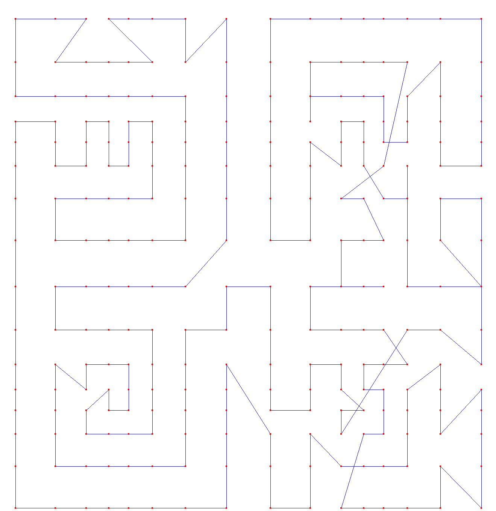

This is not the best solution but it far better than after 10000 generations without the optimization algorithm.


Another example with a more complex path:
Initial state :
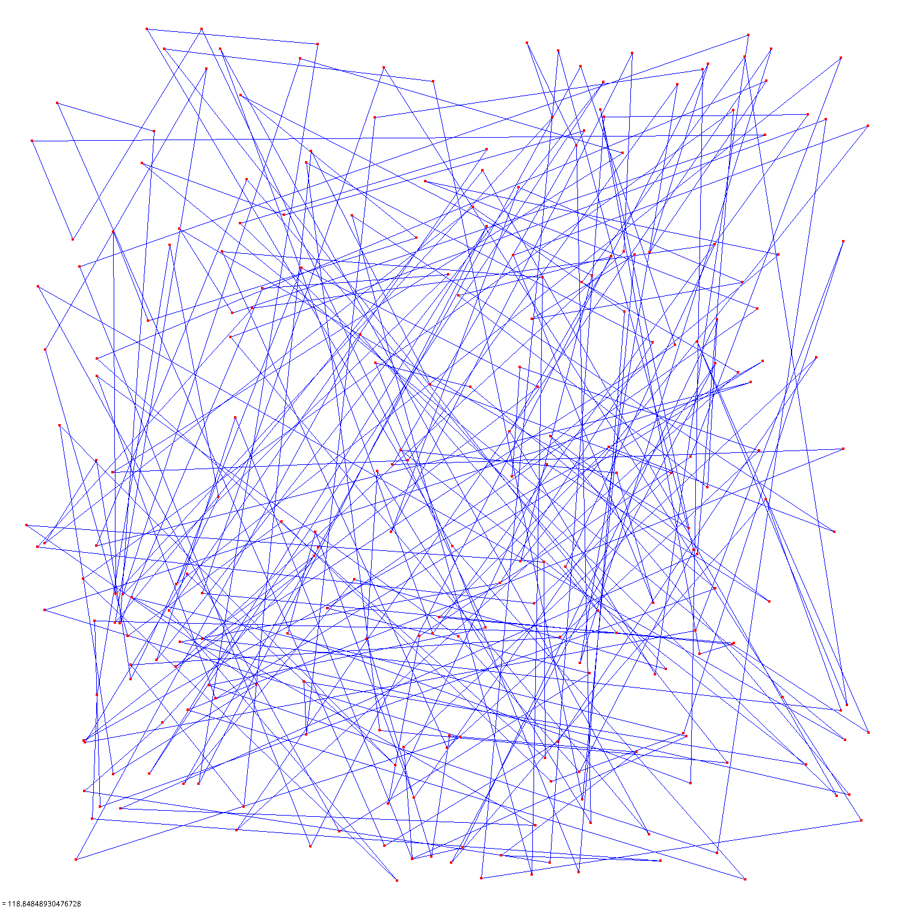

After only less than 100 iterations:
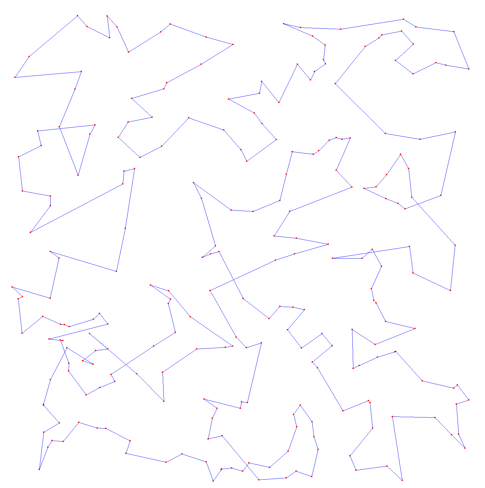

# Conclusion

To conclude, Genetic algorithms are a type of optimization algorithm that are useful for solving complex problems that are difficult to solve using traditional methods. They are based on the principles of natural selection in biology and involve iteratively improving a population of candidate solutions through the application of a set of operators such as crossover, mutation, and selection.

One of the main advantages of genetic algorithms is that they can find high-quality solutions to complex problems even when little is known about the problem domain. This makes them well-suited to problems that are difficult to model mathematically or that have many constraints and variables.

On the other hand, genetic algorithms can be computationally expensive and can require a large number of iterations to converge on a high-quality solution. They can also be sensitive to the parameters that are used to control the algorithm, such as the population size and the mutation rate, and can require some experimentation to determine the best values for these parameters. Additionally, genetic algorithms can sometimes get stuck in local optima, which can limit the quality of the solutions that they are able to find.